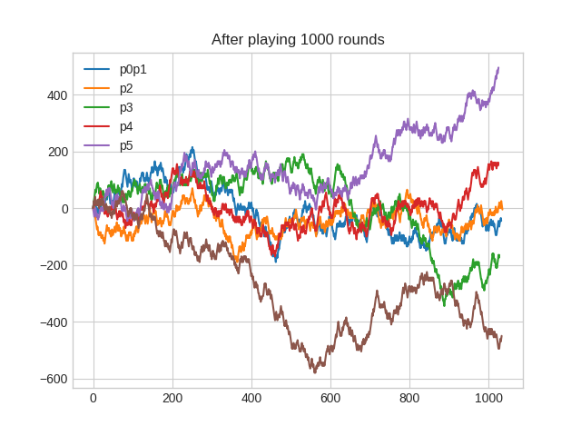

# Black-jack
Have you ever wondered what would happen in the long run if you play Blackjack at a casino "by the Blackjack chart/table"? In this project I simulate playing blackjack at a casino to find out the expected value of dealer wins and other stats. 

## How to use this program:
From the terminal: 

- `python3 sim_blackjack.py rounds players`
  
  - rounds: number of rounds to simulate.
  - players: number of players at the table.

 ## Outputs:
  - ### dealer_stats.png
  
  - ### players_balance.png 
  

  - ### stats file: Each player's stats. The last item in this file is the dealer's stats.
    - wins: 456      winning %: 44.40%
    - losses: 491     losing %: 47.81%
    - pushes: 80     push %: 7.79%
    - total hands: 1027
    - final balance: -65.0

  - ### player_records folder: results of every single hand played by each player. Example:
      - player hand: 2 K 9 21
      - dealer hand: 5 K 10 25
      - Win
      -- -------------------
      - player hand: 10 K 20
      - dealer hand: J 10 20
      - Push
      - -------------------
      - player hand: 3 A J 2 7 23
      - dealer hand: 10 Q 20
      - Busted

## How the dealer plays
  - 17 or above, the dealer must stand.
  - 16 or below, the dealer must keep hitting until the dealer is at or above 17.
  - If dealer has an ace and counting it as 11 puts the dealer at or above 17 then the dealer must stand.
  
## How the players play
  - players use two charts: The hit_stay_or_double.csv chart and the splitting.csv chart. These charts tell the players exactly what to do for every possible scenario.

  - The hit_stay_or_double chart takes two inputs: the player total and the dealer face-up-card, and returns either hit, stay, or double.

  - the splitting chart is used when the player is dealt a pair as the original hand. The pair and the dealer face-up-card is the input and output is either split or continue playing.

  - Example, player is dealt a pair of 8s. Player splits. Then the player is dealt another 8. He will split that pair again. Now a player has 3 hands and the game continues.

## Results
- After running a simulation of one million rounds and 6 players at the table, I am getting the following results:

  - dealer wins about 48% of the time.
  - dealer loses about 43% of the time.
  - dealer pushes about 8% of the time.

- I was thinking that if the deck favors the dealer or if the deck favors the players then I would see all the players losing/winning together. I don’t see this trend in the players_balance graph.

## Other info
- Each player bets $10 for each hand.
If a player gets a natural Blackjack, then the dealer pays 1.5 times the bet, so $15.

- My findings are contrary to what I hear about some only 0.5% house-advantage if you play by the chart. My simulation shows a 5% advantage to the house. 

- Six decks are used in the tray. cards are shuffled and then the deck is cut. 
